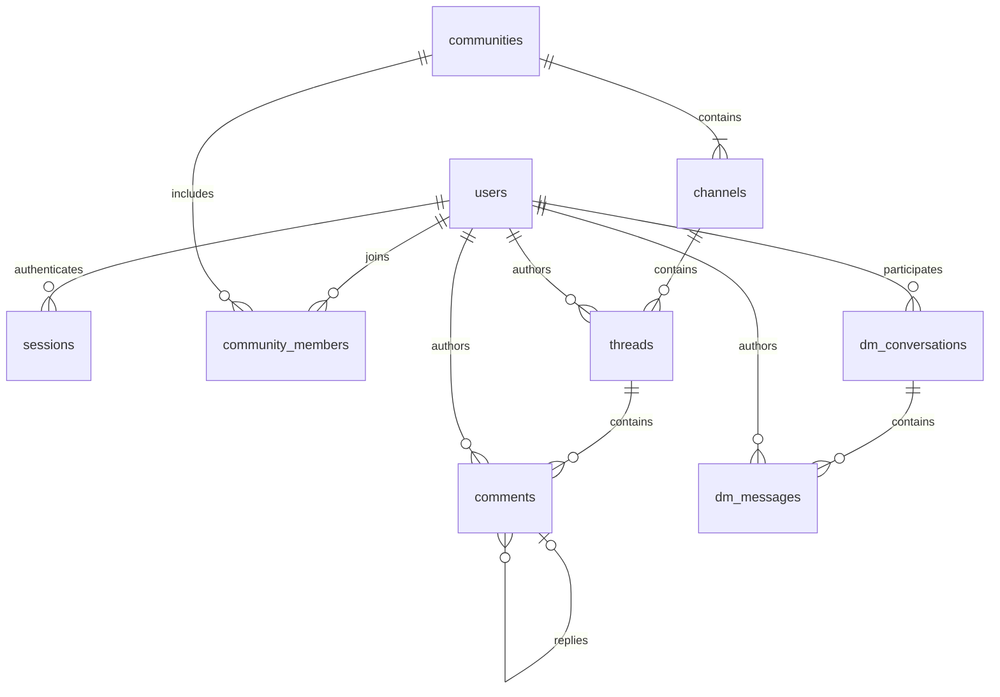

# Herdlink backend

Rust REST API using [Axum](https://docs.rs/axum/0.8.9/axum/) and [SQLx](https://docs.rs/sqlx/0.9.0/sqlx/) with SQLite. The community database file is created and migrations run automatically on startup. Communities need no database server; the source graph reads from Neo4j. SQLx and the source-storage library's rusqlite versions are defined centrally in the root `Cargo.toml` under `[workspace.dependencies]`.

## Database structure

The schema, constraints, and indexes are in [the initial migration](migrations/202610030001_initial.sql). IDs are UUIDs, stored as 16-byte blobs and returned as UUID strings. Timestamps are stored as UTC ISO 8601 text and returned as RFC 3339 strings.

Roles are Rust enums, with no role lookup tables:

```rust
pub enum UserRole { User, Scientist, PharmaScout }
pub enum ChannelKind { Discussion, Announcement }
```

SQLite has no native enum type, so the migration enforces the same variants with `TEXT` columns and `CHECK` constraints, for example:

```sql
role TEXT NOT NULL DEFAULT 'user'
    CHECK (role IN ('user', 'scientist', 'pharma_scout'))
```

The tables use SQLite strict typing. Foreign keys are enabled on the connection. [SQLx connection options](https://docs.rs/sqlx/0.9.0/sqlx/sqlite/struct.SqliteConnectOptions.html) configure WAL journaling, a five-second busy timeout, and automatic file creation. A single pooled connection serializes database operations for this initial backend.

Each account has one platform role. `user` covers patients and caregivers; it does not record a person's medical status. Platform roles describe identity. All community members have equal publishing permissions regardless of their platform role. There are no community permission roles.

| Table | Purpose and main fields |
| --- | --- |
| `users` | `id`, unique `email`, unique `username`, `password_hash`, enum `role`, `created_at` |
| `sessions` | Hashed bearer token, `user_id`, `created_at`, `expires_at` |
| `communities` | `id`, unique `slug`, `name`, `description`, `created_by`, `created_at` |
| `community_members` | Composite key `(community_id, user_id)`, `joined_at` |
| `channels` | `id`, `community_id`, community-unique `slug`, `name`, enum `kind`, `position`, `created_at` |
| `threads` | `id`, `community_id`, `channel_id`, `author_id`, `title`, `body`, `created_at` |
| `comments` | `id`, `community_id`, `thread_id`, `author_id`, optional `parent_id`, `body`, `created_at` |
| `dm_conversations` | `id`, ordered pair `user_low_id` / `user_high_id`, `created_at` |
| `dm_messages` | `id`, `conversation_id`, `author_id`, `body`, `created_at` |



Every community starts with one `announcements` channel and one `discussions` channel. A unique partial index prevents creating a second announcement channel in the same community, even with a different name or slug. For example:

```text
r/wilsons-disease
├── announcements          (all members publish and comment)
└── discussions            (members publish custom threads)
    ├── My experience
    │   └── Comments and nested replies
    └── 5 signs
```

Announcements use the same thread and comment structure as discussions. Threads and comments store `community_id` directly for community-level retrieval. Composite foreign keys enforce that channels, threads, and parent comments belong to the same community, and that a parent comment belongs to the same thread. DMs are independent of communities, with one conversation per distinct pair of users.

## Run locally

From the repository root, with Rust installed:

```sh
cargo run -p backend
```

The API listens on `127.0.0.1:3000` and creates `~/.local/share/herdlink/herdlink.db` by default, creating the directory if necessary. The home directory is resolved from `HOME`. Set `DATABASE_URL=sqlite://another.db` to use a different file. `GET /health` checks database connectivity. Set `BIND_ADDR` to change the listener and `RUST_LOG` to change logging; see [.env.example](.env.example). Environment variables must be exported into the process; the server does not automatically load `.env` files.

SQLite database files and their WAL/SHM sidecars are gitignored. Use `DATABASE_URL=sqlite::memory:` for an ephemeral database.

## Authentication and permissions

The current frontend runs as a shared **Demo user**, with the ordinary `user` role. `POST /api/auth/demo` creates that identity on first use and returns a regular session. Subsequent visits reuse the same account; community membership and publishing permissions still apply. This temporary endpoint intentionally permits access to the shared demo account without a password and must be removed or disabled when introducing real login. It never issues a session if that account has been changed to a professional role.

Run `just backend` and `just frontend` in separate terminals, then open `http://localhost:3001/communities` or `/community/wilsons-disease`. The frontend proxies `/api` to `http://127.0.0.1:3000`; set `BACKEND_URL` in `apps/web/.env.local` to change that address and restart the frontend. The browser keeps its demo session in session storage, while communities, posts, and replies persist in SQLite. Use the Refresh controls to retrieve other visitors' messages.

Opening `/community/<id>` calls `POST /api/communities/{id}/open`. This transaction creates a missing community with Announcements and Discussions, joins the current user, and returns the existing community on repeat or concurrent access. IDs can be UUIDs or hyphenated names (up to 80 characters); one- and two-character IDs map to `community-<id>`. UUIDs are preserved as database IDs. Ordinary GET endpoints remain read-only.

Disease links include the readable disease name, which the frontend sends as optional `{ "name": "Huntington disease" }` to the open endpoint. Direct visits to MONDO, OMIM, or ORPHA communities also look up the disease name in Neo4j, including visits by an existing community UUID. This bounded lookup times out after two seconds and falls back to the stored/generated title if Neo4j is unavailable. Names are trimmed and limited to 100 characters. New communities store this title; existing communities with an automatically generated identifier title are upgraded on access. Community IDs, slugs, channels, posts, and previously chosen titles remain intact. The stored name is used in the community view and directory, including subsequent visits without the name parameter.

Register, log in, or start a demo session to receive `{ "user": {...}, "token": "...", "expires_at": "..." }`. Send the token as `Authorization: Bearer <token>` on all `/api` requests except registration, login, and demo session creation. Passwords use Argon2id; only SHA-256 hashes of random bearer tokens are stored. Sessions expire after 30 days; logout immediately revokes the current token.

Registration always assigns `user`. Professional roles must currently be provisioned through a trusted database connection, for example `UPDATE users SET role = 'scientist' WHERE username = 'alex';`. There is no public role-assignment endpoint. Request bodies reject unknown fields, including attempts to supply `role`, `author_id`, or `community_id` where the server derives them.

Any authenticated user may create or discover communities, and communities are open to join. Reading channels, threads, and comments requires membership. Creators are automatically joined. All members can publish announcements and discussion threads and comment on both kinds of thread. Membership records only track who joined and when; there is no role-assignment endpoint.

Only a DM's two participants may list or send its messages. Requests by other users return 404, as do requests for nonexistent conversations. Account email addresses are only returned in the current user's authentication/profile responses.

## Endpoints

All bodies and successful data responses are JSON. List responses are arrays. Lists accept `?limit=50&offset=0`, with a maximum limit of 100 and offset of 10000; the channel list is the fixed pair of default channels. Threads, communities, conversations, and DM messages are ordered newest first; comments are oldest first. Ties use the ID for deterministic ordering.

| Method | Path | Body / behavior |
| --- | --- | --- |
| GET | `/health` | Database health; no authentication |
| POST | `/api/auth/register` | `{ "email", "username", "password" }`; 201 |
| POST | `/api/auth/login` | `{ "email", "password" }` |
| POST | `/api/auth/demo` | Temporary shared demo account; returns a normal `user` session |
| POST | `/api/auth/logout` | Revokes current session; 204 |
| GET | `/api/me` | Current account |
| GET | `/api/graph` | Empty without a scope; `q` returns one disease, or explicit `result_uid` selects a bounded tool-result graph (`limit` defaults to 180, maximum 400) |
| GET | `/api/graph/evidence` | Stored papers for `id` and `kind`; 20 papers per page with `offset` and `has_more` |
| GET / POST | `/api/communities` | List, or create with `{ "slug", "name", "description"? }`; creation returns 201 |
| GET | `/api/communities/{id}` | Community metadata |
| POST | `/api/communities/{id}/open` | Create if missing and join; accepts a UUID or slug and optional `{ "name" }`; upgrades generated titles; idempotent |
| POST | `/api/communities/{id}/join` | Join idempotently; returns membership |
| GET | `/api/communities/{id}/channels` | Default channels |
| GET / POST | `/api/channels/{id}/threads` | List (optional `q` searches title/body, up to 200 characters; with `limit`/`offset`), or publish with `{ "title", "body" }`; creation returns 201 |
| GET | `/api/threads/{id}` | Thread including community, channel, and author IDs |
| GET / POST | `/api/threads/{id}/comments` | List, or comment with `{ "body", "parent_id"? }`; creation returns 201 |
| GET / POST | `/api/dms` | List own conversations, or get/create with `{ "recipient_id" }`; returns 200 |
| GET / POST | `/api/dms/{id}/messages` | List, or send with `{ "body" }`; creation returns 201 |

Service errors use `{ "error": "message" }`: 400 for invalid values/references, 401 for missing/invalid sessions, 403 for insufficient community permissions, 404 for absent resources, and 409 for uniqueness conflicts. Axum request parsing failures (such as malformed JSON or UUIDs) use its standard rejection responses. Request bodies are capped at 256 KiB. Passwords are 12–1024 bytes, thread titles at most 300 characters, thread bodies at most 40000, and comments/DMs at most 10000.

Example registration:

```sh
curl -s http://127.0.0.1:3000/api/auth/register \
  -H 'Content-Type: application/json' \
  -d '{"email":"alex@example.com","username":"alex","password":"a long local test password"}'
```

Use the returned token to create a community, then fetch its channels to obtain their IDs:

```sh
curl -s http://127.0.0.1:3000/api/communities \
  -H "Authorization: Bearer $TOKEN" \
  -H 'Content-Type: application/json' \
  -d '{"slug":"wilsons-disease","name":"Wilson disease","description":"Experiences and discussion"}'
```

## Source graph

Export `NEO4J_URI`, `NEO4J_USER`, `NEO4J_PASSWORD`, and `NEO4J_DATABASE` from [.env.example](.env.example) to point at the instance populated by [biomedical_graph](../biomedical_graph/README.md). Connections are lazy: communities still work when Neo4j is offline. An empty graph returns an empty overview; the viewer never creates example sources, schema, or relationships. Reads have a 15-second application timeout and return 503 if Neo4j is unavailable.

`GET /api/graph` returns `{ nodes, edges, query, result_uid, truncated, generated_at }`. Without a nonempty disease query or explicit tool-result scope it returns an empty snapshot without connecting to Neo4j. There is no database-wide overview. Ordinary `q` searches disease names/identifiers, prefers exact matches and canonical diseases, and returns at most one disease with no neighbors or edges. Mapped PubTator aliases resolve to their canonical disease when available. Genes and publications do not qualify as disease search results.

Nodes have stable source UIDs, type, label, external links, and a disease community URL where applicable. An explicit `result_uid` selects objects belonging to one stored tool `FetchResult`; that scoped read expands a bounded three-hop neighborhood, projects domain connections from provenance chains, and hides operational/cache nodes. Streaming chat instead projects the exact returned tool objects without reading unrelated neighbors. It caps raw nodes at 2,000 and raw edges at 5,000; `truncated` also signals clipping to the requested visible-node limit. Edges have stable evidence IDs, endpoints, labels, source context, and an evidence kind.

The projection distinguishes extracted relations, disease/phenotype annotations (including excluded and conflicting phenotypes), identifier mappings, ontology hierarchy, and publication mentions. HPO annotation citations also connect publications to the disease they describe. A mention is contextual literature, not evidence of a biological association. Paper queries run independently of the bounded overview and paginate stored `Publication` nodes; opaque, non-PubMed citation identifiers are not resolved into papers. HPO relationship papers match the specific profile/term and positive or excluded annotation rows; extracted-relation papers come from the original document. PubTator summary counts can exist without individual paper IDs. In that case the UI shows the reported count, explains the missing citations, and links to the corresponding PubTator relation search. Literature search links are separate from stored supporting papers.

Disease nodes link to `/community/<normalized disease identifier>`; mapped PubTator diseases share their canonical disease's community. The existing community-on-access flow creates and joins the community only when its link is opened.

The home page starts empty, makes no initial graph request, and renders the matching disease with Sigma.js after a search. Clearing the search clears the graph. Chat history starts collapsed and can be expanded from the left rail. Hover previews details; clicking a node or edge pins its details so subsequent hover events cannot replace them. The pin control, close button, another explicit selection, or clicking the empty canvas can release/replace that selection.

`GraphExplorer` renders streamed snapshots from the shared chat provider and also accepts an explicit `snapshot` prop. Its Graphology model reconciles stable IDs in place and keeps retained node positions and the Sigma camera. Disease search and Refresh read one matching disease; a new search begins a new conversation. Chat tool calls cache fetched biomedical data and stream scoped graph updates, as described below.

## Validation

```sh
cargo fmt --all -- --check
cargo clippy --workspace --all-targets -- -D warnings
cargo test --workspace
```

The default integration tests create isolated SQLite databases and apply the actual migrations; no database server or environment variables are required. Tests cover registration/login/logout/expiry, enum role persistence, equal announcement publishing permissions, membership, nested comments, cross-scope foreign keys, pagination, duplicate DM conversations, unauthorized DM reads/writes, and graph authentication/validation/unavailable responses.

The graph provenance test is opt-in and writes fixtures. Run it against a fresh, isolated Neo4j instance with authentication disabled, never the application database:

```sh
NEO4J_TEST_URI=127.0.0.1:17687 cargo test -p backend --test graph -- --ignored
```

It checks projections, positive/excluded evidence, pagination, tool-result selection, bounded output, and unchanged Neo4j node/edge counts across all API reads. Frontend graph reconciliation tests run with `bun run test:graph` in `apps/web` and are included in `bun run check`.

This is the initial REST backend. Live WebSocket delivery, custom channel management, editing/deletion, voting, global cross-community search, private/invite-only communities, and group DMs are not implemented. Public deployment still needs an account verification/recovery flow and login abuse controls; the current implementation is intended for local development.

## Streaming graph chat

The website's graph assistant uses the workspace's own `openai` Responses client
and `biomedical_graph::tools::GraphTools`. Set `OPENAI_MODEL` and either
`OPENAI_API_KEY` or `OPENAI_AUTH_FILE` **on the backend**, then restart it. No
credential is sent to the browser. For example, using an existing Codex login:

```sh
OPENAI_MODEL=gpt-6-luna OPENAI_AUTH_FILE="$HOME/.codex/auth.json" just backend
```

The selected model must be available to your account. `OPENAI_BASE_URL` is also
honored by the existing client. Environment variables must be exported; `.env`
files are not loaded automatically. Settings are captured on startup and the
OpenAI client/tools initialize lazily, so community pages and ordinary chat
replies do not require a Neo4j connection.

The backend discovers a full snapshot in `./phenotype-data` when started from the
repository root, or uses `HPO_DATA_DIR`. Only a configured real corpus enables
HPO tools; the tiny test fixture is never used as the website's similarity
corpus. `just graph-data` downloads official data into a new empty directory.
`just graph-seed` caches bounded Huntington, Parkinson and ALS examples and
related literature through the real PubTator clients. Phenotype mapping failures
are reported without guessing. Chat tool calls also fetch/cache new PubTator
objects on demand, so additional manual imports are not needed for new queries.

- `POST /api/chat`: `{ "message": "Find related diseases through shared genes", "conversation_id": null, "disease": "Huntington disease" }`.
  Supply the returned conversation UUID for follow-ups. `disease` is optional
  context for a new conversation. Messages are limited to 4,000 characters.
- `GET /api/chats`: the current user's last 100 conversation summaries.
- `GET /api/chats/{id}`: saved messages and the latest bounded graph; private to
  the authenticated owner.

The POST returns an SSE body with named JSON events: `conversation` (`id`),
`text` (`delta`), `tool` (`id`, `name`, `label`, `status`, optional `added`),
`graph` (`snapshot`, `label`, `added`), `done`, and `error` (`message`). Ten-second
keepalives work through the existing Next API proxy. The browser parses SSE
across chunk/UTF-8 boundaries, updates text immediately, and reconciles Sigma
without resetting the camera or pinned details. Metadata-only updates keep positions;
changes to nodes or connections reflow the layout with collision spacing. Stop cancels the HTTP
stream and releases the conversation guard; tool results already shown remain
stored. An in-flight upstream fetch may already have reached PubTator, but all
cache writes are idempotent. Conversations retain complete Responses output
items (including encrypted reasoning and tool outputs) for follow-up replay,
without accepting arbitrary model history from the browser.

Tools use automatic selection: conversational replies can run without any tool
call or graph change. Research is bounded to 12 model rounds, 10 results per
entity/relation call, 3 phenotype matches, 5 pages and 5 annotated PMIDs per call,
and 30 visible nodes. Phenotype views show at most six positively annotated
shared features rather than complete profiles or ontology ancestors. Complete
comparison fields and supporting papers remain available in the details panel.
Restoring older chats applies the same limits. Successful tool projections—not a database-wide scan—update the
conversation's graph. Existing visible canonical/alias nodes can be joined with
stored mapping edges; this never adds neighbors. Four streams may run at once,
with one active turn per conversation. Long conversations request a new chat
at 120 displayed messages or two MB of replay history.

Edges distinguish PubTator summary associations, extracted relations, curated
phenotypes, absent/conflicting annotations, simGIC phenotype similarity,
identifier mappings, annotation citations and paper mentions. Node details
record the research step that added them. `pubtator_relation_papers` persists
oriented query evidence (`RelationEvidence` / `SUPPORTED_BY`) for individual
papers; article annotations retain the original extracted relation. Phenotype
similarity shows the corpus size and shared/conflicting terms; its citations
support shared positive HPO annotations, not the score itself. Publication
counts and simGIC scores are never presented as confidence probabilities.

Validation covers pre-completion text streaming, no-tool replies, follow-up
replay, owner isolation, concurrent turns, disconnects, malformed/oversized
requests, fragmented SSE, bounded phenotype views, and graph spacing during expansion. With an isolated Neo4j:

```sh
NEO4J_TEST_URI=127.0.0.1:17687 cargo test -p backend --test chat -- --include-ignored
```

Responses stream and continuation semantics follow the official
[streaming](https://developers.openai.com/api/docs/guides/streaming-responses)
and [function-calling](https://developers.openai.com/api/docs/guides/function-calling) documentation.


## Survey and membership API

The frontend now signs in through `/api/auth/login` or registers through
`/api/auth/register`, rather than starting a demo session automatically. The public
demo credentials are `demo@herdlink.local` / `HerdlinkDemo123!`; the reserved demo
identity keeps its existing memberships and saved chats when its old random
password is upgraded. It remains a normal user.

Pass `{ "preview": true }` to the community open endpoint to create/resolve a
community without joining it. The default is retained for older API clients.
`GET /api/communities/{id}/membership` returns `joined` and `member_count`;
`POST /api/communities/{id}/join` is idempotent. Members can use the paginated
`GET /api/communities/{id}/members` to read usernames and roles, without emails.

`POST /api/surveys` accepts `title`, optional `description`, `communities` (1–30
`{key,name}` targets), and `questions` (1–10 `{id,prompt,kind,options}` objects).
Question kinds are `short_text` and `single_choice`; choices need 2–8 unique
options. Targets resolve to communities without joining the creator. Community
UUID/slug aliases and overlapping members are deduplicated.

`POST /api/surveys/audience` accepts the same communities array and previews
unique current members without creating communities. `GET /api/surveys` is
paginated and optionally filters by `community=<uuid>`; it shows only surveys
the current user created or can answer. `GET /api/surveys/{id}` has the same access
scope. `POST /api/surveys/{id}/responses` accepts `{answers:[...]}` in question
order, requires current membership and validates all answers. Its composite
primary key enforces one response per person; duplicate submissions return 409.
Later joiners become eligible automatically. Only creators receive aggregated
choice counts and the latest fifty written answers; identities are not included.
