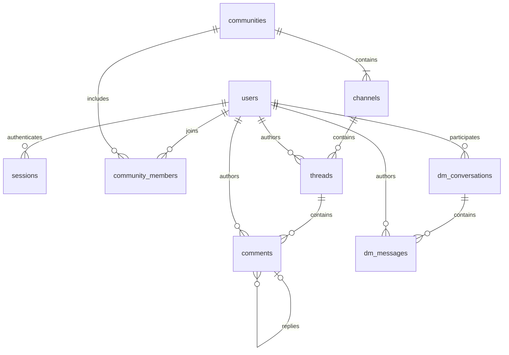

# Herdlink backend

Rust REST API using [Axum](https://docs.rs/axum/0.8.9/axum/) and [SQLx](https://docs.rs/sqlx/0.9.0/sqlx/) with SQLite. The database file is created and migrations run automatically on startup. No database server is needed. SQLx and the source-storage library's rusqlite versions are defined centrally in the root `Cargo.toml` under `[workspace.dependencies]`.

## Database structure

The schema, constraints, and indexes are in [the initial migration](migrations/202610030001_initial.sql). IDs are UUIDs, stored as 16-byte blobs and returned as UUID strings. Timestamps are stored as UTC ISO 8601 text and returned as RFC 3339 strings.

Roles are Rust enums, with no role lookup tables:

```rust
pub enum UserRole { User, Scientist, PharmaScout }
pub enum ChannelKind { Discussion, Announcement }
```

SQLite has no native enum type, so the migration enforces the same variants with `TEXT` columns and `CHECK` constraints, for example:

```sql
role TEXT NOT NULL DEFAULT 'user'
    CHECK (role IN ('user', 'scientist', 'pharma_scout'))
```

The tables use SQLite strict typing. Foreign keys are enabled on the connection. [SQLx connection options](https://docs.rs/sqlx/0.9.0/sqlx/sqlite/struct.SqliteConnectOptions.html) configure WAL journaling, a five-second busy timeout, and automatic file creation. A single pooled connection serializes database operations for this initial backend.

Each account has one platform role. `user` covers patients and caregivers; it does not record a person's medical status. Platform roles describe identity. All community members have equal publishing permissions regardless of their platform role. There are no community permission roles.

| Table | Purpose and main fields |
| --- | --- |
| `users` | `id`, unique `email`, unique `username`, `password_hash`, enum `role`, `created_at` |
| `sessions` | Hashed bearer token, `user_id`, `created_at`, `expires_at` |
| `communities` | `id`, unique `slug`, `name`, `description`, `created_by`, `created_at` |
| `community_members` | Composite key `(community_id, user_id)`, `joined_at` |
| `channels` | `id`, `community_id`, community-unique `slug`, `name`, enum `kind`, `position`, `created_at` |
| `threads` | `id`, `community_id`, `channel_id`, `author_id`, `title`, `body`, `created_at` |
| `comments` | `id`, `community_id`, `thread_id`, `author_id`, optional `parent_id`, `body`, `created_at` |
| `dm_conversations` | `id`, ordered pair `user_low_id` / `user_high_id`, `created_at` |
| `dm_messages` | `id`, `conversation_id`, `author_id`, `body`, `created_at` |



Every community starts with one `announcements` channel and one `discussions` channel. A unique partial index prevents creating a second announcement channel in the same community, even with a different name or slug. For example:

```text
r/wilsons-disease
├── announcements          (all members publish and comment)
└── discussions            (members publish custom threads)
    ├── My experience
    │   └── Comments and nested replies
    └── 5 signs
```

Announcements use the same thread and comment structure as discussions. Threads and comments store `community_id` directly for community-level retrieval. Composite foreign keys enforce that channels, threads, and parent comments belong to the same community, and that a parent comment belongs to the same thread. DMs are independent of communities, with one conversation per distinct pair of users.

## Run locally

From the repository root, with Rust installed:

```sh
cargo run -p backend
```

The API listens on `127.0.0.1:3000` and creates `~/.local/share/herdlink/herdlink.db` by default, creating the directory if necessary. The home directory is resolved from `HOME`. Set `DATABASE_URL=sqlite://another.db` to use a different file. `GET /health` checks database connectivity. Set `BIND_ADDR` to change the listener and `RUST_LOG` to change logging; see [.env.example](.env.example). Environment variables must be exported into the process; the server does not automatically load `.env` files.

SQLite database files and their WAL/SHM sidecars are gitignored. Use `DATABASE_URL=sqlite::memory:` for an ephemeral database.

## Authentication and permissions

The current frontend runs as a shared **Demo user**, with the ordinary `user` role. `POST /api/auth/demo` creates that identity on first use and returns a regular session. Subsequent visits reuse the same account; community membership and publishing permissions still apply. This temporary endpoint intentionally permits access to the shared demo account without a password and must be removed or disabled when introducing real login. It never issues a session if that account has been changed to a professional role.

Run `just backend` and `just frontend` in separate terminals, then open `http://localhost:3001/communities` or `/community/wilsons-disease`. The frontend proxies `/api` to `http://127.0.0.1:3000`; set `BACKEND_URL` in `apps/web/.env.local` to change that address and restart the frontend. The browser keeps its demo session in session storage, while communities, posts, and replies persist in SQLite. Use the Refresh controls to retrieve other visitors' messages.

Opening `/community/<id>` calls `POST /api/communities/{id}/open`. This transaction creates a missing community with Announcements and Discussions, joins the current user, and returns the existing community on repeat or concurrent access. IDs can be UUIDs or hyphenated names (up to 80 characters); one- and two-character IDs map to `community-<id>`. UUIDs are preserved as database IDs. Ordinary GET endpoints remain read-only.

Register, log in, or start a demo session to receive `{ "user": {...}, "token": "...", "expires_at": "..." }`. Send the token as `Authorization: Bearer <token>` on all `/api` requests except registration, login, and demo session creation. Passwords use Argon2id; only SHA-256 hashes of random bearer tokens are stored. Sessions expire after 30 days; logout immediately revokes the current token.

Registration always assigns `user`. Professional roles must currently be provisioned through a trusted database connection, for example `UPDATE users SET role = 'scientist' WHERE username = 'alex';`. There is no public role-assignment endpoint. Request bodies reject unknown fields, including attempts to supply `role`, `author_id`, or `community_id` where the server derives them.

Any authenticated user may create or discover communities, and communities are open to join. Reading channels, threads, and comments requires membership. Creators are automatically joined. All members can publish announcements and discussion threads and comment on both kinds of thread. Membership records only track who joined and when; there is no role-assignment endpoint.

Only a DM's two participants may list or send its messages. Requests by other users return 404, as do requests for nonexistent conversations. Account email addresses are only returned in the current user's authentication/profile responses.

## Endpoints

All bodies and successful data responses are JSON. List responses are arrays. Lists accept `?limit=50&offset=0`, with a maximum limit of 100 and offset of 10000; the channel list is the fixed pair of default channels. Threads, communities, conversations, and DM messages are ordered newest first; comments are oldest first. Ties use the ID for deterministic ordering.

| Method | Path | Body / behavior |
| --- | --- | --- |
| GET | `/health` | Database health; no authentication |
| POST | `/api/auth/register` | `{ "email", "username", "password" }`; 201 |
| POST | `/api/auth/login` | `{ "email", "password" }` |
| POST | `/api/auth/demo` | Temporary shared demo account; returns a normal `user` session |
| POST | `/api/auth/logout` | Revokes current session; 204 |
| GET | `/api/me` | Current account |
| GET / POST | `/api/communities` | List, or create with `{ "slug", "name", "description"? }`; creation returns 201 |
| GET | `/api/communities/{id}` | Community metadata |
| POST | `/api/communities/{id}/open` | Create if missing and join; accepts a UUID or slug; idempotent |
| POST | `/api/communities/{id}/join` | Join idempotently; returns membership |
| GET | `/api/communities/{id}/channels` | Default channels |
| GET / POST | `/api/channels/{id}/threads` | List (optional `q` searches title/body, up to 200 characters; with `limit`/`offset`), or publish with `{ "title", "body" }`; creation returns 201 |
| GET | `/api/threads/{id}` | Thread including community, channel, and author IDs |
| GET / POST | `/api/threads/{id}/comments` | List, or comment with `{ "body", "parent_id"? }`; creation returns 201 |
| GET / POST | `/api/dms` | List own conversations, or get/create with `{ "recipient_id" }`; returns 200 |
| GET / POST | `/api/dms/{id}/messages` | List, or send with `{ "body" }`; creation returns 201 |

Service errors use `{ "error": "message" }`: 400 for invalid values/references, 401 for missing/invalid sessions, 403 for insufficient community permissions, 404 for absent resources, and 409 for uniqueness conflicts. Axum request parsing failures (such as malformed JSON or UUIDs) use its standard rejection responses. Request bodies are capped at 256 KiB. Passwords are 12–1024 bytes, thread titles at most 300 characters, thread bodies at most 40000, and comments/DMs at most 10000.

Example registration:

```sh
curl -s http://127.0.0.1:3000/api/auth/register \
  -H 'Content-Type: application/json' \
  -d '{"email":"alex@example.com","username":"alex","password":"a long local test password"}'
```

Use the returned token to create a community, then fetch its channels to obtain their IDs:

```sh
curl -s http://127.0.0.1:3000/api/communities \
  -H "Authorization: Bearer $TOKEN" \
  -H 'Content-Type: application/json' \
  -d '{"slug":"wilsons-disease","name":"Wilson disease","description":"Experiences and discussion"}'
```

## Validation

```sh
cargo fmt --all -- --check
cargo clippy --workspace --all-targets -- -D warnings
cargo test --workspace
```

The integration tests create isolated SQLite databases and apply the actual migrations. No Docker, database server, or environment variables are required. Tests cover registration/login/logout/expiry, enum role persistence, equal announcement publishing permissions, membership, nested comments, cross-scope foreign keys, pagination, duplicate DM conversations, and unauthorized DM reads/writes.

This is the initial REST backend. Live WebSocket delivery, custom channel management, editing/deletion, voting, search, private/invite-only communities, and group DMs are not implemented. Public deployment still needs an account verification/recovery flow and login abuse controls; the current implementation is intended for local development.
